# Home

> I have not been home in seven years, so I built a morning back.

A small browser game about being given one day in Yangon. Made by [Su Myat Noe](https://imsumyatnoe.github.io).

**[Play it here](https://imsumyatnoe.github.io/Home/)** · No install, nothing to download. Open it and walk.


---

## Why I made it

I was born in Yangon and I left in September 2019 to start my master's in Tokyo. I thought I would be back by the following summer. I did not say goodbye to anybody properly, because it did not feel like the kind of leaving that needed one.

Seven years later I still have not been.

The strange part is that my memory of the city never faded. I can still walk from my house to the tea shop in my head, in the right order, with the right smells. What I lost was never the picture. It was the ordinary morning. Ordering tea in two words without thinking about them. Eating standing up because there are no chairs. Somebody straightening my longyi without asking.

So I built a morning back, and now it belongs to whoever plays it.

---

## The twelve

| | | |
|---|---|---|
| မုန့်ဟင်းခါး Mohinga | နန်းကြီးသုပ် Nan gyi thoke | ဆမူဆာသုပ် Samusa thoke |
| လက်ဖက်သုပ် Laphet thoke | ငါးပိရည် Nga pi yay | ရှမ်းခေါက်ဆွဲ Shan khauk swe |
| ကြေးအိုး Kyay oh | အုန်းနို့ခေါက်ဆွဲ Ohn no khauk swe | မုန့်ဖက်ထုပ် Mont phet htoke |
| မုန့်လင်မယား Mont lin ma yar | ရွှေရင်အေး Shwe yin aye | လက်ဖက်ရည် Laphet yay |

The mohinga cart packs up at nine, the way it always did. Everything else will wait for you.

---

## Walking through it

### 1. Dress yourself first

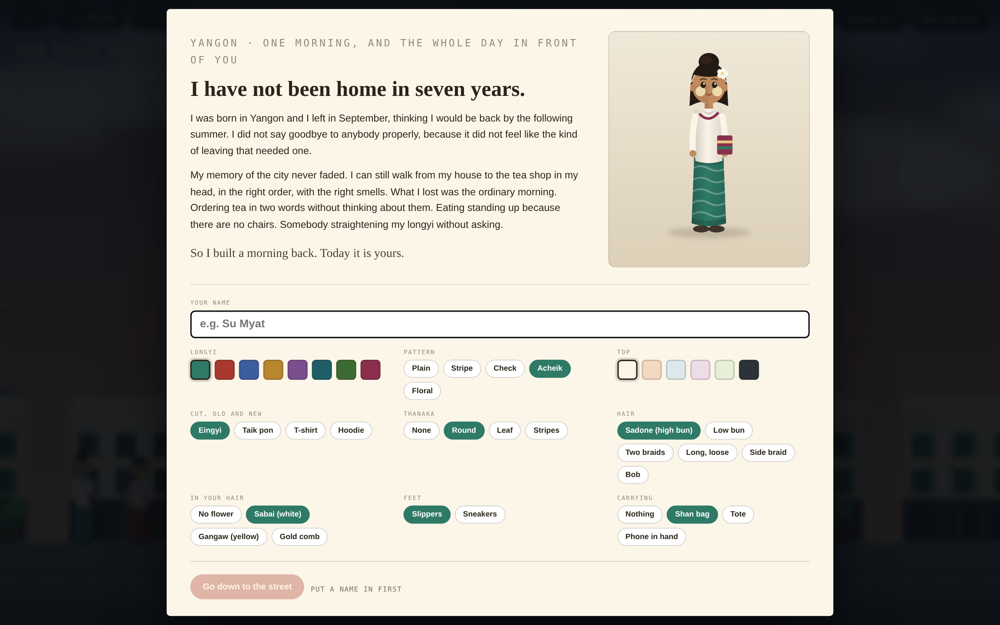

Put your name in, then put on something you would actually wear. Longyi in eight colours, and the pattern is separate: plain, stripe, check, acheik, floral. Eingyi, taik pon, a t shirt or a hoodie, because both are true now. Thanaka as a round patch, a leaf or two stripes. Sadone, a low bun, two braids, a side braid, long or a bob, with sabai or gangaw or a gold comb in it. Slippers or sneakers. A Shan bag, a tote, or your phone in your hand.

### 2. Read how the day goes

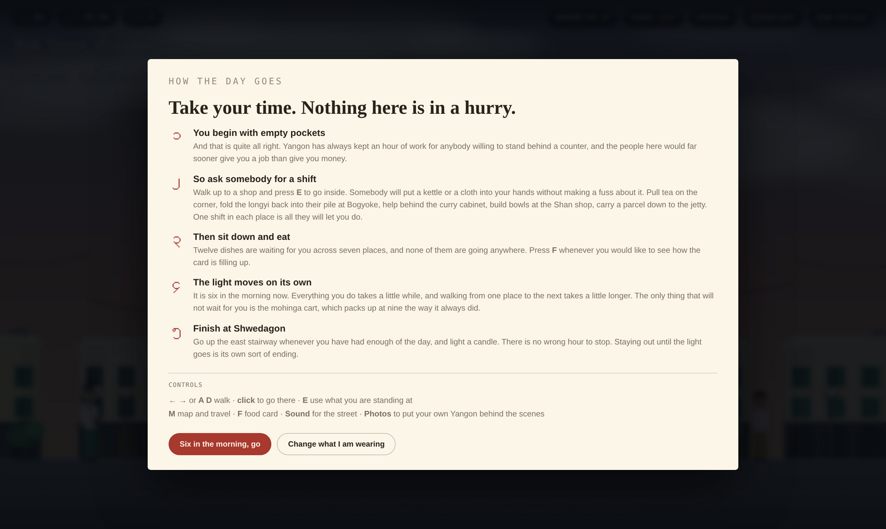

Five things, in Burmese numerals. The important one is the first: you start with empty pockets and nobody is going to hand you money.

### 3. Walk out onto 36th Street

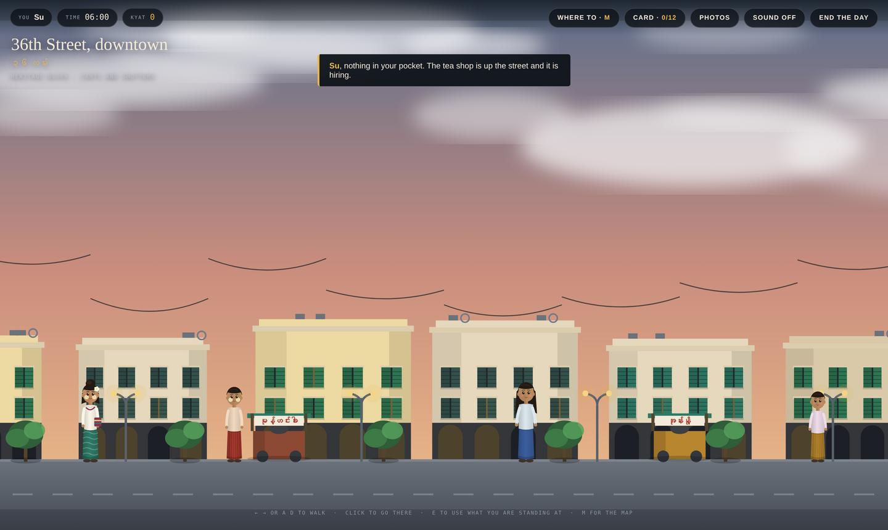

Colonial shophouses with their shutters and tangled wires, carts along the kerb, people going past. Walk with the arrow keys, or click where you want to be.

### 4. Choose where to go

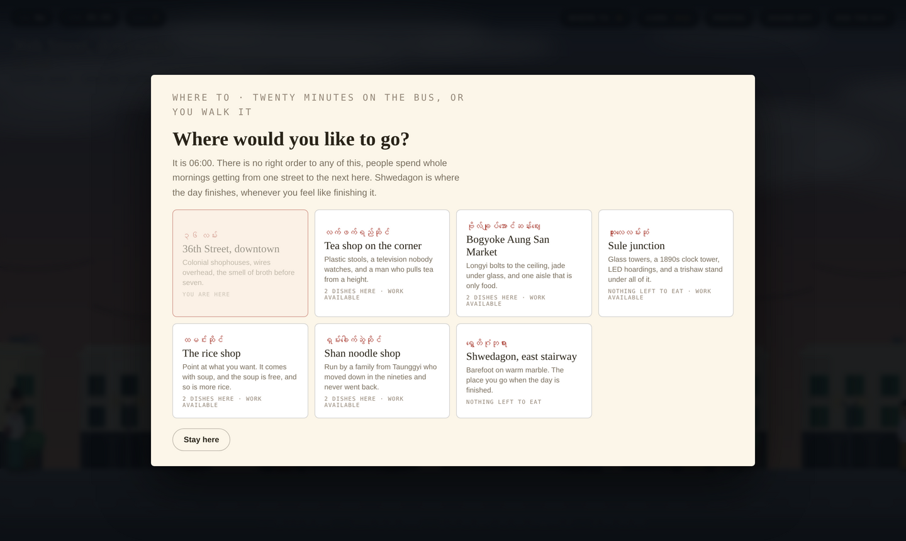

Seven places. The tea shop, Bogyoke Zay, the rice shop, the Shan shop, Sule junction, 36th Street, and Shwedagon where the day ends. Twenty minutes on the bus between any two of them.

### 5. Go inside

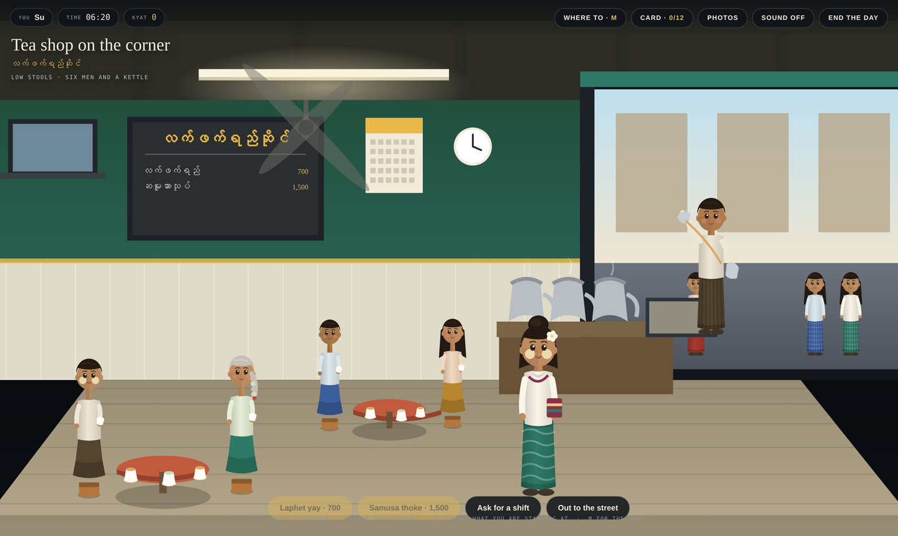

Every shop is its own room. The tea shop is open to the street with the light coming in, kettles steaming on the front counter, men on low stools with their cups, a fan turning overhead and a television nobody is watching.

### 6. Ask for a shift

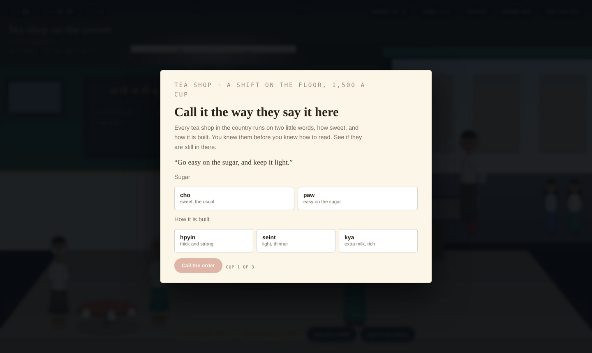

A customer says what they want in plain words and you have to call it the way it is said here. Two little words: how sweet, and how it is built. Cho or paw. Hpyin, seint or kya.

### 7. Then pull it high


Hold the button to lift the pour and let go somewhere in the gold. It is the part everybody stops to watch, and there is no harm in the ones that miss.


He counts the notes into your hand twice, because he always did.

### 8. The market, if you want another hour of work

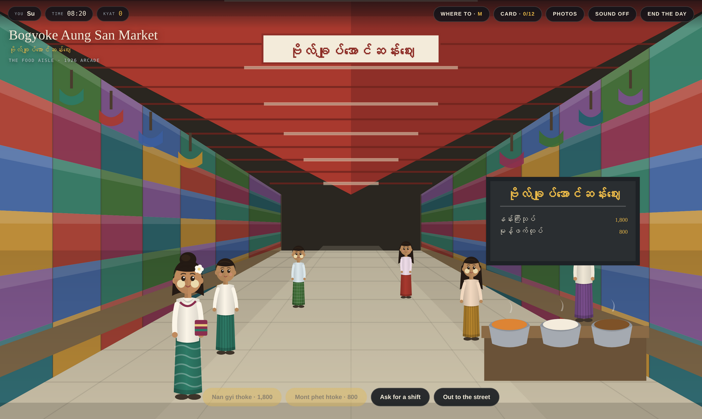

An arcade aisle running away from you under a slatted roof, stalls stacked to the ceiling with longyi. She knocked a pile over reaching for a bag and remembers exactly what order they were in.

### 9. Then sit down and eat

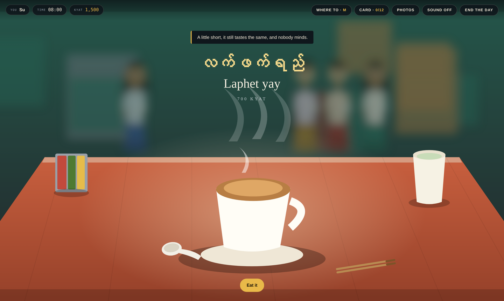

The bowl comes down onto the table in front of you with its name above it, the steam still on it, the condiment caddy and the free glass of plain tea already there.

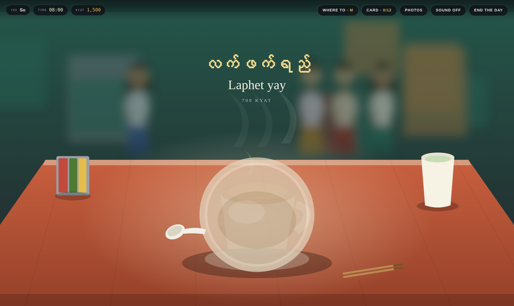

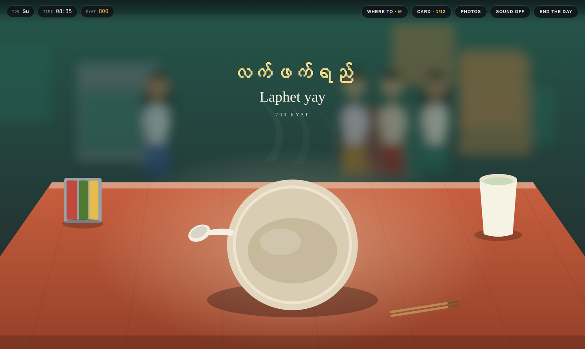

Then you actually eat it, and afterwards it tells you what it tastes of and one small thing about eating it.

### 10. Finish whenever you like

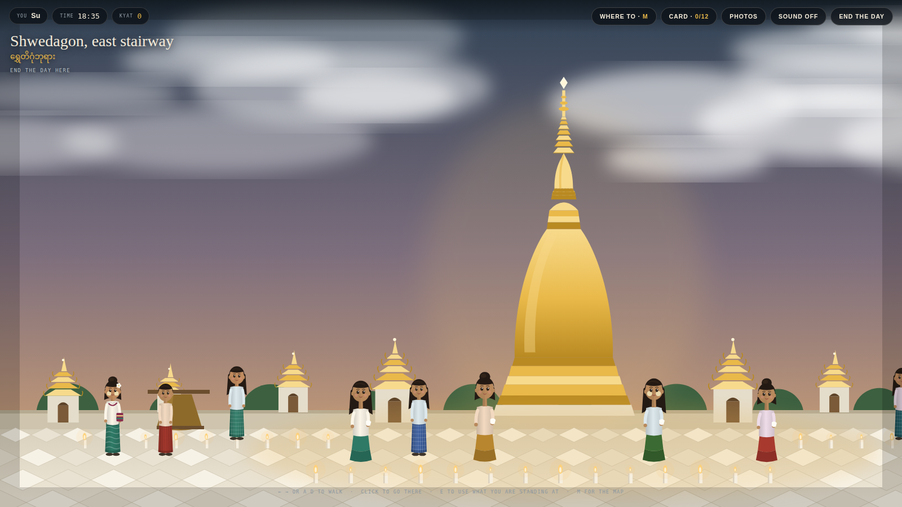

Everybody goes up before they leave the country. Mothers bring their children the week before a flight and stand them in front of it so the child will have seen it properly once.

Go up the east stairway whenever you have had enough of the day, light a candle, and say quietly what you came back for. Two hundred others light around yours while the sky goes over. Whatever you write there is what the last page answers to, so it is worth writing the true one.

---

## Your own Yangon

The **Photos** button puts your own photographs behind any of the seven places, with the people and the food drawn on top of them. Nothing uploads, the images stay in your browser.

There is also a slot for your own closing music, if the piece that plays over the candles is not the one you want.

---

## Running it

One HTML file. No build step, no dependencies, no server.

```
open index.html
```

Everything is drawn in code: the shophouses, the arcade at Bogyoke, the interiors, the people, all twelve dishes. The only thing it fetches is the typefaces, so it wants a connection but nothing else.

Sound is synthesised in the browser rather than loaded, so there are no audio files either. Traffic and horns on the street, kettle noise and chatter inside, and a low drone with a bell at the pagoda.

---

🕯

**Home keeps a seat for you.**
**It has not moved.**

မကြာခင် ပြန်တွေ့မယ်

🕯
